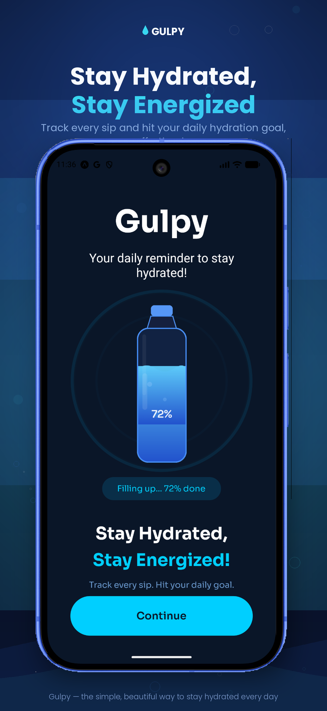
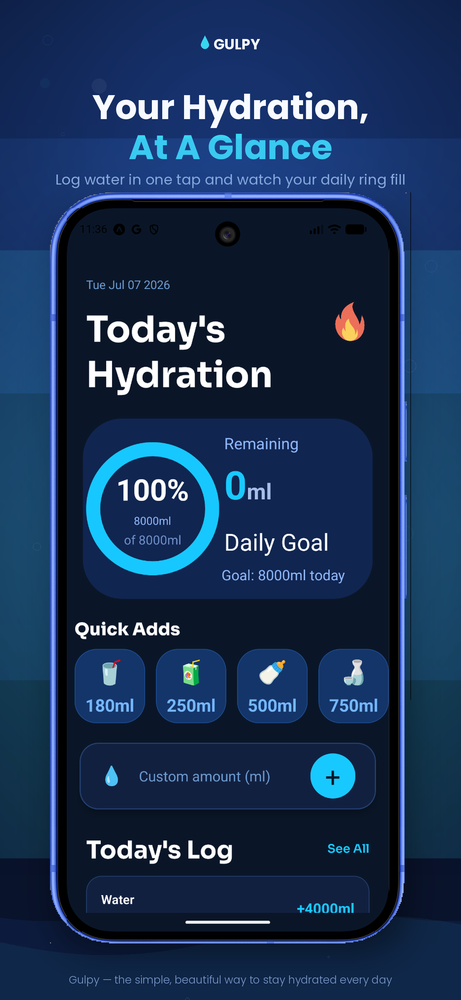
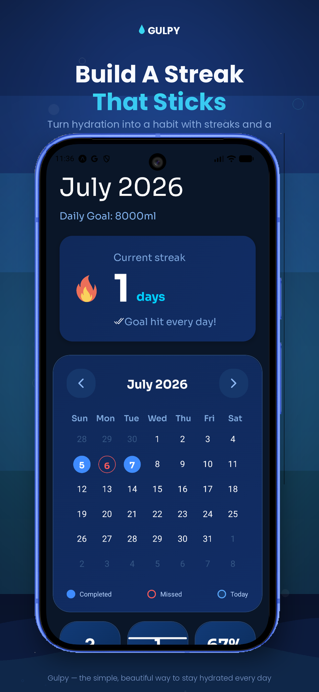

<div align="center">

# 💧 Gulpy

**Your daily reminder to stay hydrated.**

Gulpy is a beautifully simple hydration tracker built with React Native and Expo — log water in one tap, watch your daily goal fill up in real time, and build a streak you actually want to keep.

[](https://expo.dev)
[](https://reactnative.dev)
[](#)

</div>

---

## Overview

Staying hydrated shouldn't need a spreadsheet. Gulpy turns drinking water into a quick, satisfying habit loop: set a daily goal, log sips with a tap, and let streaks and smart reminders do the rest. No clutter, no sign-up walls — just a clean, glanceable ring that fills up as your day does.

## ✨ Features

- 💧 **One-tap logging** — Quick-add presets (180ml, 250ml, 500ml, 750ml) or enter a custom amount in seconds.
- 🎯 **Daily goal ring** — A live progress ring shows exactly how much you've had and how much is left, with your goal in ml, glasses, and bottles.
- 🔥 **Streaks that stick** — A running streak counter rewards you for hitting your goal every day, so hydration becomes a habit instead of a chore.
- 📅 **Monthly calendar view** — See completed, missed, and in-progress days at a glance, with a full history of your hydration habits.
- ⏰ **Smart reminders** — Customizable drink reminders throughout the day, built on one-off scheduled notifications so pausing and restarting your schedule always behaves correctly.
- 🎛️ **Personalized daily goals** — An interactive dial lets you pick a daily water target, with live conversions to glasses and bottles.
- 🧾 **Daily log** — Every entry is time-stamped and listed so you can review or adjust your day's intake.
- 🎨 **Premium, native-feel UI** — Glassmorphism cards, spring animations, and a deep navy/blue/cyan palette designed to feel calm rather than clinical.

## 📱 Screenshots

<div align="center">



</div>

## 🛠️ Tech Stack

- **Framework:** React Native (Expo)
- **Language:** JavaScript
- **Notifications:** `expo-notifications` (one-off `DATE` triggers)
- **Storage:** AsyncStorage
- **Styling:** `expo-linear-gradient`, custom SVG components (`react-native-svg`)
- **Animation:** React Native's Animated / spring physics

## 🚀 Getting Started

```bash
# Clone the repo
git clone https://github.com/<your-username>/gulpy.git
cd gulpy

# Install dependencies
npm install

# Start the Expo dev server
npx expo start
```

Then scan the QR code with the **Expo Go** app on your phone, or run it on a simulator:

```bash
npx expo start --ios      # iOS Simulator
npx expo start --android  # Android Emulator
```

## 🗺️ Roadmap (To Be Continued)

- [ ] Apple Health / Google Fit sync
- [ ] Widgets for quick logging
- [ ] Weekly & monthly insights
- [ ] Custom drink types (coffee, tea, etc.) with hydration multipliers

## 🤝 Contributing

Contributions, issues, and feature requests are welcome. Feel free to check the [issues page](../../issues) if you'd like to help out.


---

<div align="center">
Made with passion by <a href="#">Adrika</a>
</div>
